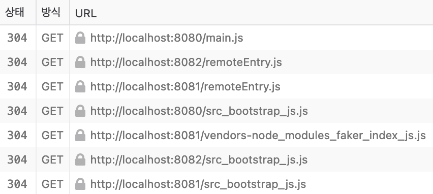

# MicroFrontend

웹팩 `ModuleFederationPlugin` 플러그인을 사용한 런타임 연동방식의 마이크로 프론트엔드 예제

## 실행

```shell
# dependency 설치
$ task init

# 개발 서버 실행
$ task start
```

* container 서버는 `http://localhost:8080`에서 실행
* products 서버는 `http://localhost:8081`에서 실행
* cart 서버는 `http://localhost:8082`에서 실행

http://localhost:8080 으로 접속해서 제품 목록과 카트가 제대로 표시되는지 확인한다.



1. container 의 manifest 파일(`main.js`) 로드
2. `container/src/index.js` 에서 `import('./bootstrap')`를 실행하면 부트스트랩에서 필요한 cart, products 의 manifest 파일( `remoteEntry.js`) 로드
3. container 부트스트랩 파일(`src_bootstrap.js`) 로드
4. cart, products 에서 사용하는 파일들 로드

## Products 프로젝트

* products 프로젝트는 단독으로도 사용 가능하며, container 프로젝트에서 런타임에 로드해서 사용할 수도 있다.
* `src/index.js` 파일에서 `faker` 라이브러리를 사용해 랜덤으로 제품명을 표시한다.
* `public/index.html` 파일은 로컬 개발 서버 실행시에만 필요하며, 배포시에는 container 프로젝트에서 js 파일만 로드하기 때문에 필요없다.

### ModuleFederationPlugin

`ModuleFederationPlugin` 플러그인을 사용해 container 에서 참조할 수 있도록 설정한다:

```js
const ModuleFederationPlugin = require('webpack/lib/container/ModuleFederationPlugin');

module.exports = {
  plugins: [
    new ModuleFederationPlugin({
      name: 'products',
      filename: 'remoteEntry.js',
      exposes: {
        './ProductsIndex': './src/index',
      },
    }),
    // ...
  ],
};
```

* `name`: 모듈명. container 프로젝트 `ModuleFederationPlugin` 플러그인의 `remotes`에서 이 이름을 참조한다.
* `filename`: mainfest 파일명. 특별한 이유가 없다면 `remoteEntry.js` 을 사용하는 것이 좋다.
* `exposes`: 외부로 노출할 소스 파일들의 이름을 매핑한다. 여기서 매핑하지 않은 소스 파일은 container 프로젝트에서 로드할 수 없다.
    * container 프로젝트에서 `./src/index` 파일을 로드하려면 `./ProductsIndex`라는 경로를 import 해야 한다.

## Cart 프로젝트

* cart 프로젝트는 단독으로도 사용 가능하며, container 프로젝트에서 런타임에 로드해서 사용할 수도 있다.
* `src/index.js` 파일에서 `faker` 라이브러리를 사용해 랜덤으로 카트에 담긴 제품 개수를 표시한다.

> 그 외의 설정은 Products 프로젝트와 동일하다.


## Container 프로젝트

* container 프로젝트는 외부 모듈을 표시할 컨테이너를 제공한다.

### ModuleFederationPlugin

* `ModuleFederationPlugin` 플러그인을 사용해 런타임에 외부 모듈을 로드해 실행한다.
* [Promise Based Dynamic Remotes](https://webpack.js.org/concepts/module-federation/#promise-based-dynamic-remotes) 참고

```js
new ModuleFederationPlugin({
  name: 'container',
  remotes: {
    productsApp: 'products@http://localhost:8081/remoteEntry.js',
    cartApp: 'cart@http://localhost:8082/remoteEntry.js',
  },
}),
```

* `name`: 모듈명. 다른곳에서 사용되지는 않으며 명확한 의미 전달을 위해 설정한다.
* `remotes`: container에서 로드할 프로젝트 목록
    * key: 로드할 모듈의 이름. container 소스 파일에서 `import abc from 'productsApp';`와 같은 코드가 있는 경우 지정한 URL에서 파일을 로드한다.
    * value: 로드할 원격 모듈의 엔트리 주소
        * 패턴: `<모듈명>@<remoteEntry URL>`
        * 모듈명: products 프로젝트의 `ModuleFederationPlugin` 플러그인에서 지정한 `name`
        * remoteEntry URL: products 프로젝트를 로드하기 위한 엔트리 파일 URL. producs 프로젝트의 `ModuleFederationPlugin` 플러그인에서 지정한 `filename`을 사용한다.

### `src/index.js`

```js
import('./bootstrap');
```

* 이 파일은 `src/bootstrap.js` 파일을 로드하는 일만 하게 되며, 모든 작업은 `src/bootstrap.js`에서 진행한다.
* [`import()`](https://webpack.js.org/api/module-methods/#import-1) 함수는 동적 모듈 로딩을 위한 웹팩 함수이며, 여기서는 외부 모듈을 비동기 로드하는 작업을 한다.

### `src/bootstrap.js`

```js
import 'productsApp/ProductsIndex';
import 'cartApp/ProductsIndex';
```

* `productsApp`: `ModuleFederationPlugin` 플러그인의 `remotes` 객체에서 지정한 Key
    * 웹팩 빌드시 `node_modules`에서 `productsApp` 패키지를 먼저 검색하며 발견하지 못한 경우 `remotes` 객체에서 매핑된 URL 에서 엔트리 파일을 로드한다.
* `ProductsIndex`: products 프로젝트의 `ModuleFederationPlugin` 플러그인에서 expose 한 이름.
* `import 'productsApp/ProductsIndex';`는 결국 products 프로젝트의 `src/index.js` 파일을 임포트하게 된다.

### `public/index.html`

렌더링할 컨테이너 HTML.

cart, products 모듈 데이터를 표시할 DOM 객체가 필요하다.

```html
<!DOCTYPE html>
<html>
  <body>
    <div id="dev-products"></div>
    <div id="dev-cart"></div>
  </body>
</html>
```
